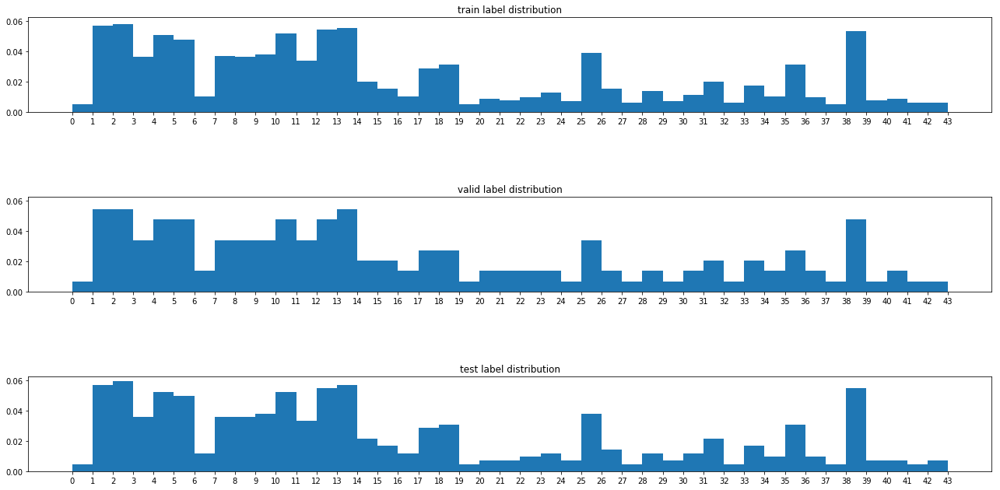
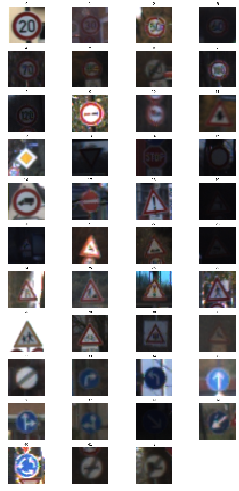
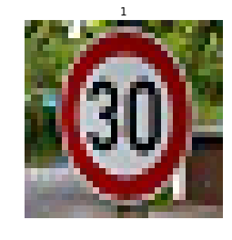
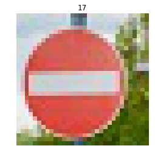
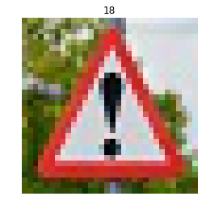

# **Traffic Sign Recognition**

## Writeup Template

### You can use this file as a template for your writeup if you want to submit it as a markdown file, but feel free to use some other method and submit a pdf if you prefer.

---

**Build a Traffic Sign Recognition Project**

The goals / steps of this project are the following:
* Load the data set (see below for links to the project data set)
* Explore, summarize and visualize the data set
* Design, train and test a model architecture
* Use the model to make predictions on new images
* Analyze the softmax probabilities of the new images
* Summarize the results with a written report

[//]: # (Image References)

[image1]: ./examples/visualization.jpg "Visualization"
[image2]: ./examples/grayscale.jpg "Grayscaling"
[image3]: ./examples/random_noise.jpg "Random Noise"
[image4]: ./examples/placeholder.png "Traffic Sign 1"
[image5]: ./examples/placeholder.png "Traffic Sign 2"
[image6]: ./examples/placeholder.png "Traffic Sign 3"
[image7]: ./examples/placeholder.png "Traffic Sign 4"
[image8]: ./examples/placeholder.png "Traffic Sign 5"

## Rubric Points
###Here I will consider the [rubric points](https://review.udacity.com/#!/rubrics/481/view) individually and describe how I addressed each point in my implementation.  

---
### Writeup / README

#### 1. Provide a Writeup / README that includes all the rubric points and how you addressed each one. You can submit your writeup as markdown or pdf. You can use this template as a guide for writing the report. The submission includes the project code.

You're reading it! and here is a link to my [project code](https://github.com/udacity/CarND-Traffic-Sign-Classifier-Project/blob/master/Traffic_Sign_Classifier.ipynb)

### Data Set Summary & Exploration

#### 1. Provide a basic summary of the data set. In the code, the analysis should be done using python, numpy and/or pandas methods rather than hardcoding results manually.

I used the numpy library to calculate summary statistics of the traffic
signs data set:

* The size of training set is 34799 images
* The size of the validation set is 4410
* The size of test set is 12630
* The shape of a traffic sign image is (32, 32, 3)
* The number of unique classes/labels in the data set is 43

#### 2. Include an exploratory visualization of the dataset.

Here is an exploratory visualization of the data set. It is a frequency
histogram showing the relative class frequencies for each set.

Here is what all of the classes look like.

### Design and Test a Model Architecture

#### 1. Describe how you preprocessed the image data. What techniques were chosen and why did you choose these techniques? Consider including images showing the output of each preprocessing technique. Pre-processing refers to techniques such as converting to grayscale, normalization, etc. (OPTIONAL: As described in the "Stand Out Suggestions" part of the rubric, if you generated additional data for training, describe why you decided to generate additional data, how you generated the data, and provide example images of the additional data. Then describe the characteristics of the augmented training set like number of images in the set, number of images for each class, etc.)

As a first step, I decided to convert the images to grayscale because it would reduce the
amount of noise in the data.

After that  a last step, I normalized the data to the interval between -1 and 1.

#### 2. Describe what your final model architecture looks like including model type, layers, layer sizes, connectivity, etc.) Consider including a diagram and/or table describing the final model.

My final model consisted of the following layers:

| Layer         		|     Description	        					|
|:---------------------:|:---------------------------------------------:|
| Input         		| 32x32x3 RGB image   							|
| Convolution 5x5     	| 1x1 stride, same padding, outputs 28x28x6 	|
| RELU					|												|
| Max pooling	      	| 2x2 stride, outputs 14x14x6 				|
| Convolution 5x5	    | 2x2 stride, outputs 10x10x16      							|
| RELU					|												|
| Max pooling	      	| 2x2 stride, outputs 5x5x16 				|
| Fully connected		| inputs 400, outputs 200        									|
| RELU					|												|
| Dropout					|	.5 drop rate											|
| Fully connected		| outputs 100        									|
| RELU					|												|
| Dropout					|	.5 drop rate											|
| Fully connected		| outputs 43        									|

#### 3. Describe how you trained your model. The discussion can include the type of optimizer, the batch size, number of epochs and any hyperparameters such as learning rate.

To train the model, I used an adam optimizer with a learning rate of .001.  The optimizer was
programmed to reduce the mean cross entropy of the training set.  I trained for 25 epochs, during
which validation loss steadily decreased.

#### 4. Describe the approach taken for finding a solution and getting the validation set accuracy to be at least 0.93. Include in the discussion the results on the training, validation and test sets and where in the code these were calculated. Your approach may have been an iterative process, in which case, outline the steps you took to get to the final solution and why you chose those steps. Perhaps your solution involved an already well known implementation or architecture. In this case, discuss why you think the architecture is suitable for the current problem.

My final model results were:
* validation set accuracy of 94.8
* test set accuracy of 93.5

My initial model was based on the LeNet architecture that was suggested in the course material.  
The architecture worked pretty well out of the gate.  I was able to get 92% accuracy on the
validation set right away.  To improve performance I added to dropout layers, one between each
fully connected layer.  The dropout layers reduced overfitting and improved the validation
accuracy to the 94-96% range.  Most of the hyperparameters worked pretty well the values
recommended in course lectures.  I played around with the learning rate, dropout rate, and the
loss function but ended up getting the best performance with the course recommended values.

### Test a Model on New Images

#### 1. Choose five German traffic signs found on the web and provide them in the report. For each image, discuss what quality or qualities might be difficult to classify.

Here are five German traffic signs that I found on the web:

  
 

The images are cropped, so it is my hope that they will be correctly classified.  I think the first 2 images are slightly
trickier than the rest because there are so many speed limit signs in the training set. It is easy to mistake signs when
they are only different by a single number.

#### 2. Discuss the model's predictions on these new traffic signs and compare the results to predicting on the test set. At a minimum, discuss what the predictions were, the accuracy on these new predictions, and compare the accuracy to the accuracy on the test set (OPTIONAL: Discuss the results in more detail as described in the "Stand Out Suggestions" part of the rubric).

Here are the results of the prediction:

The model was able to correctly guess 5 of the 5 traffic signs, which gives an accuracy of 100%.  
This is even better accuracy than was achieved on the test (93%) and validation (94%) sets.  If more
images were added to the newly acquired dataset, it likely would have converged to an accuracy similar
to the test set.  However, this still means that our model is generalizing well to new images.
Furthermore, the less confident guesses tend to resemble the ground truth.  With the exception of the blue
round about sign, all of the general caution guesses (4th row of figure) look very similar to the general
caution sign.  This is a good sign because it means that the model has learned a good, human-like
representation of traffic signs.

#### 3. Describe how certain the model is when predicting on each of the five new images by looking at the softmax probabilities for each prediction. Provide the top 5 softmax probabilities for each image along with the sign type of each probability. (OPTIONAL: as described in the "Stand Out Suggestions" part of the rubric, visualizations can also be provided such as bar charts)

The code for making predictions on my final model is located in the 12th cell of the Ipython notebook.

For the first image, the model is relatively sure that this is a 30km/h sign (probability of 0.4).
Furthermore all of the predictions were speed limit signs, which is quite reassuring.  
However, the model seemed a bit thrown by the 70km/h sign.  This is surprising considering how well it did with the
30 km/h sign.  It only guessed the 2nd sign with 7% confidence which is quite low, and it's 3rd and 4th guesses
were not even speed limit signs.  I'm not sure why it was able to learn the 30km/h sign so much better than the 70km/h
sign.  It doesn't make sense.

The model did well on the other 3 signs.  It was always at least 300% more confident of the correct sign than its next best guess.

| Probability         	|     Prediction	        					| Ground truth |
|:---------------------:|:---------------------------------------------:|:------------------:|
| .40         			| Speed limit (30km/h)   									| Speed limit (30km/h)  |
| .07     				| Speed limit (70km/h)   | Speed limit (70km/h) |
| .27					| No entry | No entry |
| .39	      			| General caution | General caution |
| .44				    | Road work | Road work |

### (Optional) Visualizing the Neural Network (See Step 4 of the Ipython notebook for more details)
#### 1. Discuss the visual output of your trained network's feature maps. What characteristics did the neural network use to make classifications?
